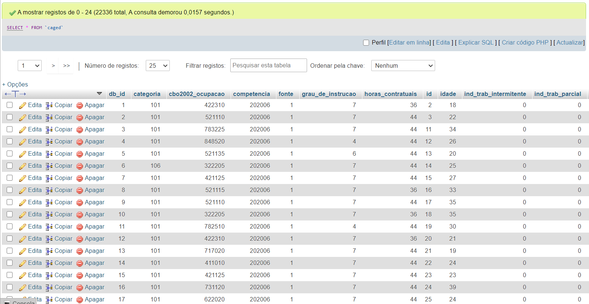

# Case Técnico - Quero Educação

Cargo: Engenheiro de Dados.

Case Técnico: Exportação, transformação e carregamento de dados em um banco de dados.

## Processo Seletivo

Foi desenvolvido um script em formato Notebook para extração dos dados disponibilizados pela API.
Os dados são então exportados para tratamento e manipulação e em seguinda inserção no banco de dados.

O Script do programa principal foi desenvolvido em Python. Faz-se a importação do dataset CSV e em seguida há uma manipulação para
adequação dos dados.

É criado de forma automática uma tabela no banco de dados com as mesmas colunas importadas pela API. 
Como banco de dados, utilizou-se o MySQL.

Os dados são inseridos no BD e em seguida é realizado uma exportação automática desse BD em um arquivo
SQL.

## Dataset

Como dataset, é realizado uma extração por meio da [API](http://dataeng.quero.com:5000/caged-data).

É criado um arquivo .CSV que é utilizado como dataset pelo script e encontra-se na pasta [dataset](https://github.com/matheusfterra/QueroEducacao/blob/master/dataset/EmployData.csv).

## Execução

O Notebook pode ser executado pelo repositório, ou pelo Notebook online Google Colab

[DataExtractor.ipynb](DataExtractor.ipynb)

ou

[Notebook Online](https://colab.research.google.com/drive/1K-L0ad9kbSJh2aEi-WKNJGwmVbZpruBd?usp=sharing)

Após criação do arquivo CSV (e alocação para a pasta dataset), deve-se alterar o arquivo [settings.json](settings.json), com os parâmentros
do banco de dados MySQL e em seguida executar o script [my_script.py](my_script.py)

## Banco de Dados

Após a execução do script principal, dentro da pasta db, é criado uma pasta com o horário atual da máquina, e dentro
haverá um arquivo .SQL, com todos os valores salvos do banco de dados, que por sua vez foi retirados da API.

## Autor

Matheus Terra

[LinkedIn](https://www.linkedin.com/in/matheus-terra/)

[Instagram](https://www.instagram.com/engenheiro_automacao/)

[WhatsApp](https://api.whatsapp.com/send?phone=5564999667424)